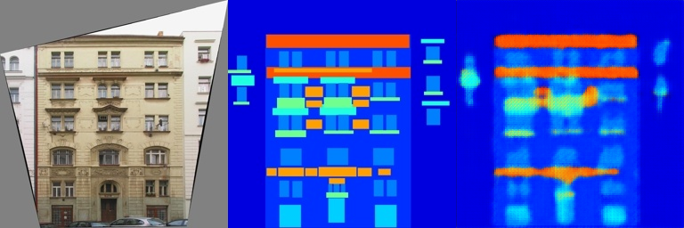
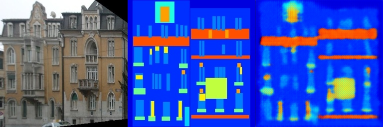
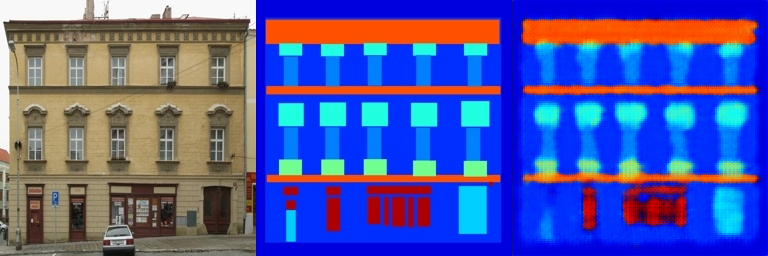
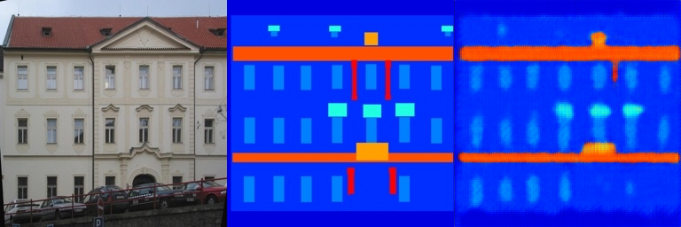
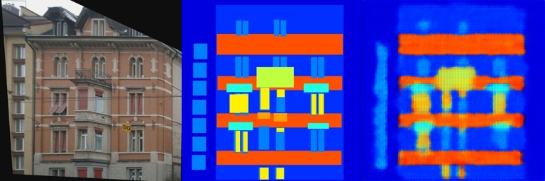
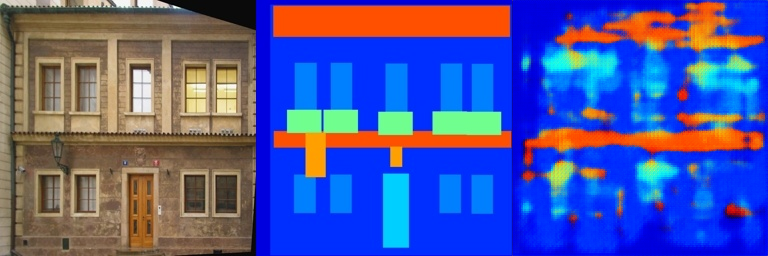
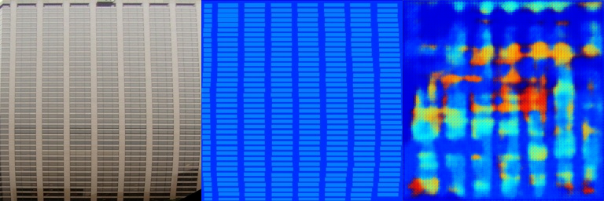
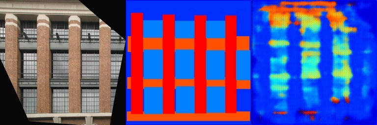
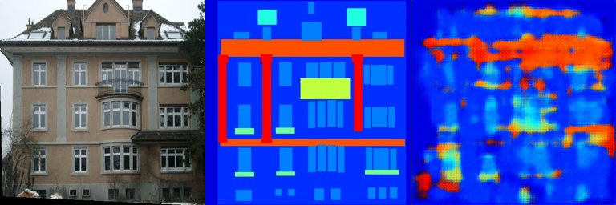
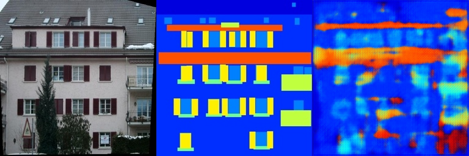

# DIP2 - Digital Image Processing

数字图像处理项目，包含 Poisson 图像融合和 Pix2Pix 图像生成两种技术。

## 项目概述

本项目实现了两种图像处理技术：

1. **Poisson 图像融合** - 基于泊松方程的图像无缝融合
2. **Pix2Pix 图像生成** - 基于全卷积网络的图像到图像转换

## 项目结构

```
DIP2/
├── FCN_network.py              # 全卷积网络定义
├── run_blending_gradio.py      # Poisson 融合交互界面
├── Poisson_result/             # Poisson 融合结果
│   └── example.mp4            # 融合演示视频
└── Pix2Pix_result/             # Pix2Pix 生成结果
    ├── train_result/          # 训练集结果
    └── val_result/            # 验证集结果
```

## 技术实现

### Poisson 图像融合

使用基于拉普拉斯算子的泊松方程优化算法，实现图像的无缝融合：

- 通过优化目标图像在掩码区域内的拉普拉斯梯度，使其与源图像一致
- 保持了背景图像在融合区域外的原始像素值
- 使用 PyTorch 进行梯度优化，支持 CUDA 加速

### Pix2Pix 图像生成

全卷积网络（FCN）用于图像到图像的转换任务：

- 编码器-解码器结构，输入输出为 256×256 RGB 图像
- 5 层卷积下采样 + 5 层反卷积上采样
- 使用 Batch Normalization 和 ReLU/Tanh 激活函数

## 结果展示

### Poisson 图像融合效果

[Poisson_result/example.mp4](Poisson_result/example.mp4)

*演示视频展示了如何将选定的图像区域无缝融合到背景图像中*

### Pix2Pix 训练结果

训练集上的生成效果：







### Pix2Pix 验证结果

验证集上的生成效果：






